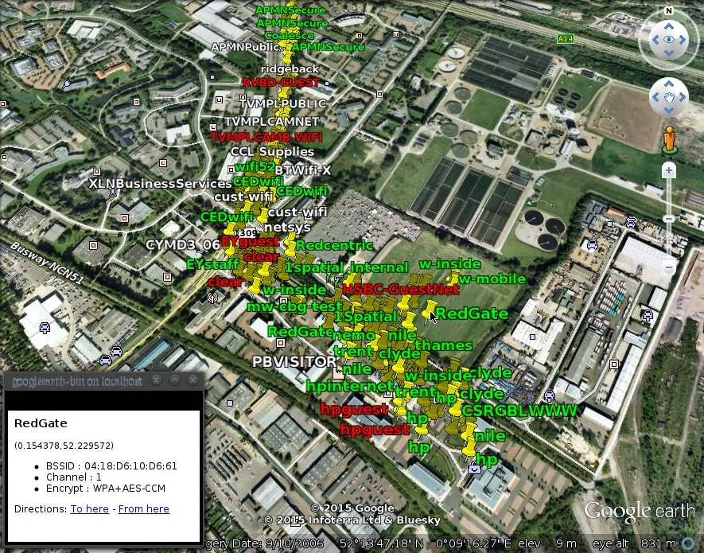

amnixiel
===
> Of the lines.

Amnixiel is a Kismet to KML converter for visualising war-driving data.

About
===
Amnixiel takes the output of Kismet, the popular wireless network detector, as input and extracts relevant information about each access point such as Network Name, supported Encryption schemes and GPS coordinates. This information is structured into KML format and printed to standard out. This KML data can then by loaded into Google Earth to visualise the location of wireless access points.

Installation
===
An "UberJar" binary package is available under the bin directory. It includes all dependencies, including Clojure so all that is required to get started is a Java runtime environment.

Usage
===

    java -jar amnixiel.jar Kismet-20150218-21-49-59-1.netxml

Output will look something like this.

    <?xml version="1.0" encoding="UTF-8"?><Document>
    <Placemark>
      <description><![CDATA[

(0.153333,52.228840)
<ul><li>BSSID : 04:18:D6:10:D6:61</li><li>Channel : 1</li><li>Encrypt : WPA+AES-CCM</li></ul>
]]></description>
      <name>BlueGate</name>
      <Point>
        <extrude>1</extrude>
        <alitiudeMode>relativeToGround</alitiudeMode>
        <coordinates>0.153333,52.228840,0</coordinates>
      </Point>
      <styleUrl>#green</styleUrl>
    </Placemark>
    </Document>
 
Kistmet produces many output files and not all of them are relevant. Feed them all the Amnixiel and it will parse what it can and leave the rest.

    java -jar amnixiel.jar ~/kismet_output/*

Output:

    File Kismet-20150218-21-49-59-1.alert could not be parsed. Skipping...
    File Kismet-20150218-21-49-59-1.kistxt could not be parsed. Skipping...
    File Kismet-20150218-21-49-59-1.nettxt could not be parsed. Skipping...
    File Kismet-20150218-21-49-59-1.pcapdump could not be parsed. Skipping...
    <?xml version="1.0" encoding="UTF-8"?><Document>
    <Placemark>
      <description><...
      ...

All KML is printed to the stdout stream. All warnings and errors are sent to stderr. Use shell redirection to create a KML file which can be loaded into Google Earth.

    java -jar amnixiel.jar ~/kismet_output/* > my_output.kml

Networks are colour coded based on their weakest supported encryption scheme.

Duplicate networks are filtered based on BSSID not ESSID. Hence, duplicate network names in the output represent distinct hardware.
